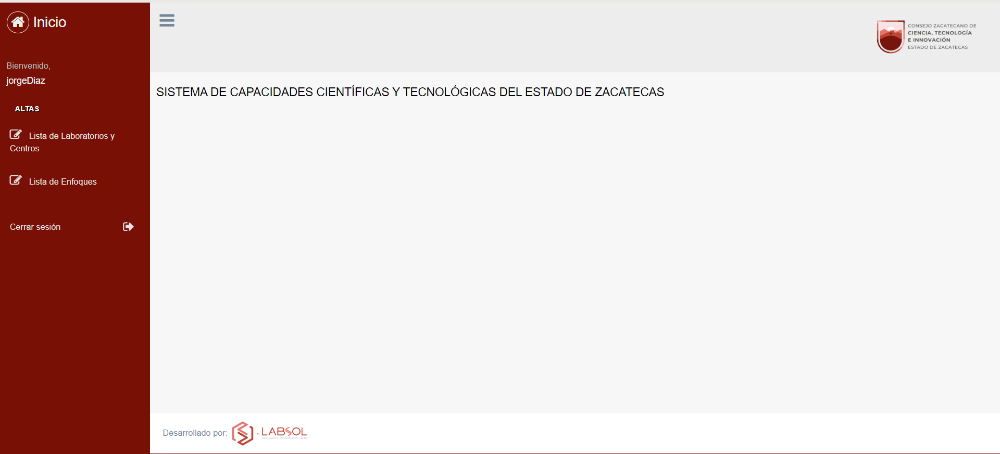

# SistemaGeolocalizacion
Sistema que permite, mediante el uso de un mapa, ya sea de google maps o alguna otra API, poder registrar centros de investigación
dentro del estado de Zacatecas.

## Estructura del proyecto
El sistema cuenta con diferentes directorios y archivos los cuales se muestran a continuación.
Para algunos de ellos se da una pequeña descripción.
```bash
├───busquedas                                  # Módulo general de búsquedas de centros de investigación.
│   │   admin.py
│   │   apps.py
│   │   models.py                                
│   │   tests.py
│   │   urls.py
│   │   views.py                                # Incluye las funciones que sirven para las vistas del módulo.
│   │   __init__.py
│   │
│   ├───migrations
│   │   │   __init__.py
│   │   │
│   │   └───__pycache__
│   │           __init__.cpython-310.pyc
│   │
│   ├───templates                               # Contiene los archivos html y js del módulo.
│   │       buscar_centro.html                  # Archivo que contiene la vista general de la página de búsquedas.
│   │       inicio.html                         # Archivo base de la página de búsquedas.
│   │       mapas.html                          # Archivo que contiene las funcionalidades del mapa de la página de búsquedas.
│   │
│   └───__pycache__
│           admin.cpython-310.pyc
│           apps.cpython-310.pyc
│           models.cpython-310.pyc
│           urls.cpython-310.pyc
│           views.cpython-310.pyc
│           __init__.cpython-310.pyc
│
├───centroinvestigacion                        # Módulo general de altas de centros de investigación.
│   │   admin.py
│   │   apps.py
│   │   forms.py                               # Archivo que contiene los formularios de la aplicación.
│   │   models.py                              # Archivo que contiene los modelos de las tablas a crear en la BD.
│   │   urls.py                                # Contiene las urls de la aplicación.
│   │   views.py                               # Contiene las funcionalidades para las vistas del módulo de altas de centros de investigación.
│   │   views_enfoque.py                       # Contiene las funcionalidades específicas para altas de areas de investigación.
│   │   __init__.py
│   │
│   ├───migrations
│   │   │   __init__.py
│   │   │
│   │   └───__pycache__
│   │           0001_initial.cpython-310.pyc
│   │           0002_area_alter_centroinvestigacion_subareaenfoque_and_more.cpython-310.pyc
│   │           0003_alter_centroinvestigacion_subareaenfoque_and_more.cpython-310.pyc
│   │           0004_alter_centroinvestigacion_municipio_and_more.cpython-310.pyc
│   │           __init__.cpython-310.pyc
│   │
│   ├───templates                              # Contiene los archivos html y js del módulo.
│   │   │   detalles_centro.html               # Contiene la vista general de la página de detalles de centros de investigación.
│   │   │   home.html                          # Página inicial del dashboard de centros de investigación.
│   │   │   index.html                         # Archivo base de la página de altas de centros y areas.
│   │   │
│   │   └───centroinvestigacion                # Contiene los archivos html del módulo de altas de centros de investigación.
│   │           centroinvestigacion_confirm_delete.html  # Contiene la vista general de la página de eliminación de un centro.
│   │           centroinvestigacion_form.html  # Contiene la vista general del formulario para dar de alta y modificar un centro.
│   │           centroinvestigacion_list.html  # Contiene la vista general de la lista de centros de investigación.
│   │           enfoque_confirm_delete.html    # Contiene la vista general de la página de eliminar un area de investigación.
│   │           enfoque_form.html              # Contiene la vista general del formulario para dar de alta un área de investigación.
│   │           enfoque_list.html              # Contiene la vista general de la lista de areas de investigación.
│   │
│   ├───tests
│   │   │   test_centroinvestigacion_forms.py
│   │   │   test_centroinvestigacion_models.py
│   │   │   test_centroinvestigacion_views.py
│   │   │   test_enfoque_views.py
│   │   │   __init__.py
│   │   │
│   │   └───__pycache__
│   │           test_centroinvestigacion_forms.cpython-310.pyc
│   │           test_centroinvestigacion_models.cpython-310.pyc
│   │           test_centroinvestigacion_views.cpython-310.pyc
│   │           test_enfoque_views.cpython-310.pyc
│   │           __init__.cpython-310.pyc
│   │
│   └───__pycache__
│           admin.cpython-310.pyc
│           apps.cpython-310.pyc
│           forms.cpython-310.pyc
│           models.cpython-310.pyc
│           tests.cpython-310.pyc
│           test_models.cpython-310.pyc
│           urls.cpython-310.pyc
│           views.cpython-310.pyc
│           views_enfoque.cpython-310.pyc
│           __init__.cpython-310.pyc
│
├───media                                      # Almacena todos los archivos, imágenes de logos y de centros de investigación.
│   ├───foto                                   # Carpeta que almacena las fotos de los centros de investigación.
│   │    
│   └───logos                                  # Carpeta que almacena los logos de los centros de investigación.
│
├───SistemaGeolocalizacion                     # Contiene las configuraciones generales del sistema.
│   │   asgi.py
│   │   settings.py                            # Contiene las configuraciones específicas que necesita el sistema.
│   │   urls.py                                # Contiene las urls generales del sistema.
│   │   wsgi.py
│   │   __init__.py
│   │
│   └───__pycache__
│           settings.cpython-310.pyc
│           urls.cpython-310.pyc
│           wsgi.cpython-310.pyc
│           __init__.cpython-310.pyc
│
├───static                                     # Contiene los archivos estáticos y de diseño de cada módulo del sistema.
│   ├───build
│   │   ├───css
│   │   │       custom.css
│   │   │       custom.min.css
│   │   │
│   │   ├───images                             # Almacena imágenes generales del sistema.
│   │   │       back_disabled.png
│   │   │       back_enabled.png
│   │   │       back_enabled_hover.png
│   │   │       favicon.ico
│   │   │       forward_disabled.png
│   │   │       forward_enabled.png
│   │   │       forward_enabled_hover.png
│   │   │       GPLv3_Logo.png
│   │   │       icono.ico
│   │   │       img.jpg
│   │   │       loading.gif
│   │   │       logo-cozcyt.png
│   │   │       Logos Labsol 2022_Mesa de trabajo 1.png
│   │   │
│   │   └───js
│   │           custom.js
│   │           custom.min.js
│   │
│   ├───css
│   │       bootstrap.css
│   │       bootstrap.iframe.css
│   │       bootstrap.min.css
│   │       custom.css
│   │       estilos_login.css
│   │
│   ├───fonts
│   │       glyphicons-halflings-regular.eot
│   │       glyphicons-halflings-regular.svg
│   │       glyphicons-halflings-regular.ttf
│   │       glyphicons-halflings-regular.woff
│   │
│   ├───js
│   │       bootstrap.min.js
│   │       bootstrap.min.js.map
│   │       jquery-1.12.4.min.js
│   │       jquery.address.js
│   │       jquery.chained.min.js
│   │       jquery.js
│   │       jquery.min.js
│   │       maps_lib.js
│   │
│   └───vendors
│       ├───animate.css
│       │       animate.min.css
│       │
│       ├───bootstrap
│       │   └───dist
│       │       ├───css
│       │       │       bootstrap-grid.css
│       │       │       bootstrap-grid.css.map
│       │       │       bootstrap-grid.min.css
│       │       │       bootstrap-grid.min.css.map
│       │       │       bootstrap-reboot.css
│       │       │       bootstrap-reboot.css.map
│       │       │       bootstrap-reboot.min.css
│       │       │       bootstrap-reboot.min.css.map
│       │       │       bootstrap.css
│       │       │       bootstrap.css.map
│       │       │       bootstrap.min.css
│       │       │       bootstrap.min.css.map
│       │       │
│       │       └───js
│       │               bootstrap.bundle.js
│       │               bootstrap.bundle.js.map
│       │               bootstrap.bundle.min.js
│       │               bootstrap.bundle.min.js.map
│       │               bootstrap.js
│       │               bootstrap.js.map
│       │               bootstrap.min.js
│       │               bootstrap.min.js.map
│       │
│       ├───font-awesome
│       │   ├───css
│       │   │       font-awesome.css
│       │   │       font-awesome.css.map
│       │   │       font-awesome.min.css
│       │   │
│       │   └───fonts
│       │           fontawesome-webfont.eot
│       │           fontawesome-webfont.svg
│       │           fontawesome-webfont.ttf
│       │           fontawesome-webfont.woff
│       │           fontawesome-webfont.woff2
│       │           FontAwesome.otf
│       │
│       ├───jquery
│       │   └───dist
│       │           jquery.js
│       │           jquery.min.js
│       │           jquery.min.map
│       │
│       └───nprogress
│               nprogress.css
│
├───usuarios                                   # Módulo general de altas de usuarios para el módulo de latas de centros y areas.
│   │   admin.py
│   │   apps.py
│   │   forms.py                               # Contiene los formularios generales de la aplicación.
│   │   models.py                              # Contiene los modelos de las tablas creadas para este módulo en la BD.
│   │   urls.py                                # Contiene las urls específicas para el módulo de altas de usuarios.
│   │   views.py                               # Contiene las funcionalidades necesarias para la aplicación.
│   │   __init__.py
│   │
│   ├───migrations
│   │   │   __init__.py
│   │   │
│   │   └───__pycache__
│   │           __init__.cpython-310.pyc
│   │
│   ├───templates                              # Contiene los archivos html del módulo de altas de usuarios.
│   │       login.html                         # Contiene la vista general del formulario para loguearse en el sistema.
│   │       user_form.html                     # Contiene la vista general del formularios para crear una cuenta nueva.
│   │
│   ├───tests
│   │   │   test_usuario_form.py
│   │   │   __init__.py
│   │   │
│   │   └───__pycache__
│   │           test_centroinvestigacion_forms.cpython-310.pyc
│   │           test_centroinvestigacion_models.cpython-310.pyc
│   │           test_usuario_form.cpython-310.pyc
│   │           __init__.cpython-310.pyc
│   │
│   └───__pycache__
│           admin.cpython-310.pyc
│           apps.cpython-310.pyc
│           forms.cpython-310.pyc
│           models.cpython-310.pyc
│           tests.cpython-310.pyc
│           urls.cpython-310.pyc
│           views.cpython-310.pyc
│           __init__.cpython-310.pyc
│
└───__pycache__
        test_centroinvestigacion_forms.cpython-310.pyc
        test_centroinvestigacion_models.cpython-310.pyc
        test_models.cpython-310.pyc

```

## Requerimientos

Todas las librerías necesarias para el funcionamiento del sistema se encuentran especificadas en el archivo requirements.txt, cabe aclarar
que solamente se incluyen aquellas que el lenguaje Python necesita para funcionar. El resto de dependencias se enuncian a continuación.

### Api de Google Maps

LA API de Google Maps es crucial para el funcionamiento del sistema, ya que de no contar con ella
no se podrán utilizar de manera correcta las funcionalidades del sistema y el módulo de búsquedas quedará inutilizable,
por lo que tenerla habilitada es vital, esta se puede obtener en el siguiente enlace:
https://cloud.google.com/

Se deben de habilitar los siguientes servicios:
 - Maps JavaScript API
 - Geocoding API

El servicio de la API de Google Maps ofrece 3 meses de prueba gratuitos, al terminar el periodo o bien
llegar al límite de consultas, en este caso 28800, se deberá de habilitar un método de pago para que
la API no dejé de funcionar.

Una vez que se tiene la API habilitada en el archivo settings.py, que se encuentra en el directorio SistemaGeolocalizacion/SistemaGeolocalizacion,
se debe de agregar en la línea que corresponde a la variable GOOGLE_MAPS_API_KEY, de momento se encuentra vacía.

También se deberá de agregar dicha API KEY en el archivo centro_investigación_form.html dentro del directorio centroinvestigación/templates en la línea #129
justo despues del apartado "key=" y antes del símbolo '&'

## Prerrequisitos

### Clonar repositorio

 ```shell
 git clone https://github.com/jorged314159/SistemaGeolocalizacion.git
  ```

### Crear entorno virtual para mejorar las dependencias

en Linux:
 ```shell
  python3 -m venv venv
  ```

en Windows:
```shell
  python3 -m venv venv
 ```

Esto creará una carpeta llamada "venv" que representa nuestro ambiente virtual y donde instalaremos todas las dependencias.

- Activamos el ambiente virtual:
  
en Linux: 
```shell
source venv/bin/activate
```

o en Windows: 
```shell
venv\Scripts\activate
```

- Instalamos las dependencias del sistema ejecutando:
```shell
(venv) pip3 install -r requirements.txt
```

### Crear base de datos

En la carpeta documentación se encuentra el archivo llamado insercionesDB.sql el cual contiene sentencias que se deben de ejecutar para crear la base de datos
que almacenará toda la información del sistema. Para esto debemos de hacer lo siguiente:

en Linux:
```shell
sudo mysql
```
Nos pedirá autenticarnos y procederemos a insertar el primer bloque de sentencias que se encuentran en el archivo

```shell
CREATE DATABASE geolocalizacion CHARACTER SET utf8mb4 COLLATE utf8mb4_general_ci;
CREATE USER 'usergeo'@'localhost' identified by 'geolocalizacion123';
GRANT ALL PRIVILEGES ON geolocalizacion.* TO 'usergeo'@'localhost';
FLUSH PRIVILEGES;
```
en Windows:
Abir una terminal del manejador de bases de datos que estemos utilizando, ejemplo DBeaver, o en su defecto la ventana de comando 
por defecto que contiene MySQL. Una vez que estemos dentro de MySQL ejecutaremos el primer bloque de sentencias

```shell
CREATE DATABASE geolocalizacion CHARACTER SET utf8mb4 COLLATE utf8mb4_general_ci;
CREATE USER 'usergeo'@'localhost' identified by 'geolocalizacion123';
GRANT ALL PRIVILEGES ON geolocalizacion.* TO 'usergeo'@'localhost';
FLUSH PRIVILEGES;
```

- Si se realiza alguna modificación al momento de nombrar la base de datos, el usuario, el host al que se conecta o su contraseña,
hay que hacer estas mismas modificaciones en el archivo settings.py en el apartado DATABASES. Si existe alguna diferencia entre los campos
mencionados es probable que no se pueda acceder de manera correcta al sistema.

### Crear migraciones

Una vez que se han instalado todas las dependencias necesarias para el funcionamiento del sistema, sin salir del entorno virtual, se deberán de realizar
las migraciones correspondientes. Esto insertará en la base de datos las tablas necesarias para almacenar la información de centros y áreas de investigación.
Para esto ejecutaremos los siguientes comandos:

en Linux:
```shell
python3 manage.py makemigrations

python3 manage.py migrate
```

en Windows:
```shell
python manage.py makemigrations

python manage.py migrate
```

### Crear super usuario
Crear un superusuario es necesario siempre y cuando se requiera administrar usuarios que ingresan al sistema. Para esto se debe de ubicar 
en el directorio que esté al nivel del archivo manage.py, es decir el directorio general del proyecto y escribir el siguiente comando:

en Linux:
```shell
python3 manage.py createsuperuser
```

en Windows:
```shell
python manage.py createsuperuser
```

### Inserciones previas a la base de datos
- Dentro del archivo insercionesDB.sql existen dos bloques de inserciones a diferentes tablas, estas inserciones deben de hacerse una vez
que, primeramente, la base de datos existe, y posteriormente se han realizado las migraciones correspondientes para que dentro de la base de datos
se creen las tablas que necesita el sistema.
Una vez que se han hecho todas las migraciones, se deben de realizar las inserciones que se incluyen en el archivo las cuales corresponden a
las áreas del conocimiento y la lista de municipios del estado.
Para esto entraremos nuevamente a nuestro manejador de base de datos como mencionamos anteriormente y ejecutar las siguientes sentencias:

Áreas del conocimiento:
```shell
INSERT INTO centroinvestigacion_area VALUES ('1', 'Físico-Matemáticas y Ciencias de la Tierra');
INSERT INTO centroinvestigacion_area VALUES ('2', 'Biología y Química');
INSERT INTO centroinvestigacion_area VALUES ('3', 'Medicina y Ciencias de la Salud');
INSERT INTO centroinvestigacion_area VALUES ('4', 'Ciencias de la Conducta y la Educación');
INSERT INTO centroinvestigacion_area VALUES ('5', 'Humanidades');
INSERT INTO centroinvestigacion_area VALUES ('6', 'Ciencias Sociales');
INSERT INTO centroinvestigacion_area VALUES ('7', 'Ciencias de Agricultura, Agropecuarias, Forestales y de Ecosistemas');
INSERT INTO centroinvestigacion_area VALUES ('8', 'Ingenierías y Desarrollo Tecnológico');
INSERT INTO centroinvestigacion_area VALUES ('9', 'Interdiciplinaria');
```

Municipios:
```shell
INSERT INTO centroinvestigacion_municipio VALUES ('1' , 'Apozol');
INSERT INTO centroinvestigacion_municipio VALUES ('2' , 'Apulco');
INSERT INTO centroinvestigacion_municipio VALUES ('3' , 'Atolinga');
INSERT INTO centroinvestigacion_municipio VALUES ('4' , 'Benito Juárez');
INSERT INTO centroinvestigacion_municipio VALUES ('5' , 'Calera');
INSERT INTO centroinvestigacion_municipio VALUES ('6' , 'Cañitas de Felipe Pescador');
INSERT INTO centroinvestigacion_municipio VALUES ('7' , 'Concepción del Oro');
INSERT INTO centroinvestigacion_municipio VALUES ('8' , 'Cuauhtémoc');
INSERT INTO centroinvestigacion_municipio VALUES ('9' , 'Chalchihuites');
INSERT INTO centroinvestigacion_municipio VALUES ('10' , 'Fresnillo');
INSERT INTO centroinvestigacion_municipio VALUES ('11' , 'Trinidad García de la Cadena');
INSERT INTO centroinvestigacion_municipio VALUES ('12' , 'Genaro Codina');
INSERT INTO centroinvestigacion_municipio VALUES ('13' , 'General Enrique Estrada');
INSERT INTO centroinvestigacion_municipio VALUES ('14' , 'General Francisco R. Murguía');
INSERT INTO centroinvestigacion_municipio VALUES ('15' , 'El Plateado de Joaquín Amaro');
INSERT INTO centroinvestigacion_municipio VALUES ('16' , 'General Pánfilo Natera');
INSERT INTO centroinvestigacion_municipio VALUES ('17' , 'Guadalupe');
INSERT INTO centroinvestigacion_municipio VALUES ('18' , 'Huanusco');
INSERT INTO centroinvestigacion_municipio VALUES ('19' , 'Jalpa');
INSERT INTO centroinvestigacion_municipio VALUES ('20' , 'Jerez');
INSERT INTO centroinvestigacion_municipio VALUES ('21' , 'Jiménez del Teul');
INSERT INTO centroinvestigacion_municipio VALUES ('22' , 'Juan Aldama');
INSERT INTO centroinvestigacion_municipio VALUES ('23' , 'Juchipila');
INSERT INTO centroinvestigacion_municipio VALUES ('24' , 'Loreto');
INSERT INTO centroinvestigacion_municipio VALUES ('25' , 'Luis Moya');
INSERT INTO centroinvestigacion_municipio VALUES ('26' , 'Mazapil');
INSERT INTO centroinvestigacion_municipio VALUES ('27' , 'Melchor Ocampo');
INSERT INTO centroinvestigacion_municipio VALUES ('28' , 'Mezquital del Oro');
INSERT INTO centroinvestigacion_municipio VALUES ('29' , 'Miguel Auza');
INSERT INTO centroinvestigacion_municipio VALUES ('30' , 'Momax');
INSERT INTO centroinvestigacion_municipio VALUES ('31' , 'Monte Escobedo');
INSERT INTO centroinvestigacion_municipio VALUES ('32' , 'Morelos');
INSERT INTO centroinvestigacion_municipio VALUES ('33' , 'Moyahua de Estrada');
INSERT INTO centroinvestigacion_municipio VALUES ('34' , 'Nochistlán de Mejía');
INSERT INTO centroinvestigacion_municipio VALUES ('35' , 'Noria de Ángeles');
INSERT INTO centroinvestigacion_municipio VALUES ('36' , 'Ojocaliente');
INSERT INTO centroinvestigacion_municipio VALUES ('37' , 'Pánuco');
INSERT INTO centroinvestigacion_municipio VALUES ('38' , 'Pinos');
INSERT INTO centroinvestigacion_municipio VALUES ('39' , 'Río Grande');
INSERT INTO centroinvestigacion_municipio VALUES ('40' , 'Sain Alto');
INSERT INTO centroinvestigacion_municipio VALUES ('41' , 'El Salvador');
INSERT INTO centroinvestigacion_municipio VALUES ('42' , 'Sombrerete');
INSERT INTO centroinvestigacion_municipio VALUES ('43' , 'Susticacán');
INSERT INTO centroinvestigacion_municipio VALUES ('44' , 'Tabasco');
INSERT INTO centroinvestigacion_municipio VALUES ('45' , 'Tepechitlán');
INSERT INTO centroinvestigacion_municipio VALUES ('46' , 'Tepetongo');
INSERT INTO centroinvestigacion_municipio VALUES ('47' , 'Teúl de González Ortega');
INSERT INTO centroinvestigacion_municipio VALUES ('48' , 'Tlaltenango de Sánchez Román');
INSERT INTO centroinvestigacion_municipio VALUES ('49' , 'Valparaíso');
INSERT INTO centroinvestigacion_municipio VALUES ('50' , 'Vetagrande');
INSERT INTO centroinvestigacion_municipio VALUES ('51' , 'Villa de Cos');
INSERT INTO centroinvestigacion_municipio VALUES ('52' , 'Villa García');
INSERT INTO centroinvestigacion_municipio VALUES ('53' , 'Villa González Ortega');
INSERT INTO centroinvestigacion_municipio VALUES ('54' , 'Villa Hidalgo');
INSERT INTO centroinvestigacion_municipio VALUES ('55' , 'Villanueva');
INSERT INTO centroinvestigacion_municipio VALUES ('56' , 'Zacatecas');
INSERT INTO centroinvestigacion_municipio VALUES ('57' , 'Trancoso');
INSERT INTO centroinvestigacion_municipio VALUES ('58' , 'Santa María de la Paz');
```
Con todo esto nuestro sistema está listo para utilizarse.

## Como utilizar el sistema

### Crear un nuevo usuario

Tendremos que dirigirnos a la url que corresponda al login del sistema: <a>nuestro_dominio/usuarios/registrar</a>


Una vez dentro procederemos a llenar el formulario como se indica en cada uno de los campos.

### Loguearse en el sistema

Ya que hemos creado a nuestro usuario, se nos redirigirá a la página de login y llenaremos este formulario para
loguearnos en el sistema.


### Dar de alta Áreas de investigación

Una vez que nos hemos logueado aparecerá la siguiente pantalla



Entraremos a la sección <b>Lista de Enfoques</b> que se encuentra en la parte izquierda y veremos la siguiente pantalla
que contiene la lista de todas las áreas y subareas de investigación que se han dado de alta


Daremos click en <b>Nuevo</b> y procederemos a llenar el formulario que se muestra


Al agregarlo se nos redirigirá a la pantalla general de Enfoques y ahí veremos el área de investigación que agregamos.


Se habilitarán botones para editar la información del área o bien eliminarla.
- Para eliminar un área de investigación esta no deberá de tener centros de investigación asociados.
Si se desea eliminar dicha área, primero se deberán de eliminar todos aquellos centros que estén asociados al área.

### Dar de alta un Centro de Investigación

En nuestro panel general entraremos a la sección <b>Lista de Laboratorios y Centros</b> y veremos la siguiente pantalla
que contiene la lista de todos los centros de investigación que hemos dado de alta


Daremos click en <b>Nuevo</b> y procederemos a llenar el formulario que se muestra


- La opción de Geolocalización tiene dos funcionalidades, la primera y menos exacta es llenando los campos del domicilio del centro
de investigación, una vez que se han llenado presionaremos el botón <b>Agregar Marcador</b> y nos ubicará el marcador en la posición
aproximada del centro, para una mejor precisión se usará la segunda funcionalidad, la cual consiste en arrastrar el marcador hasta
la posición exacta donde se encuentra el centro de investigación. Como sugerencia es mejor utilizar esta segunda forma por la precisión que presenta 
al momento de agregar un marcador.


Una vez que hemos dado de alta el centro de investigación se nos redirigirá a la página principal de Centros de Investigación y veremos el centro que hemos agregado


Se habilitarán botones para editar la información del centro o bien eliminarlo.
